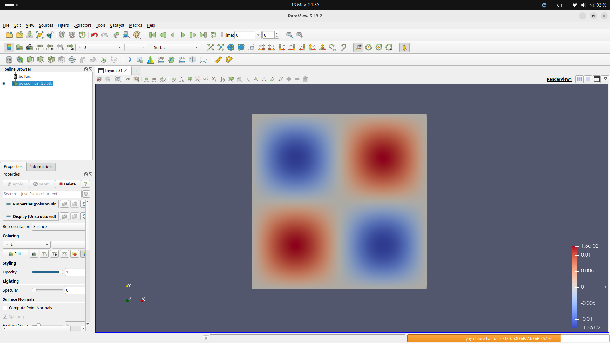
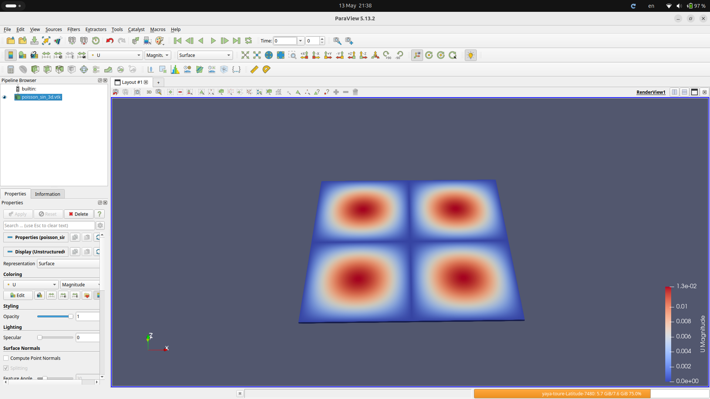
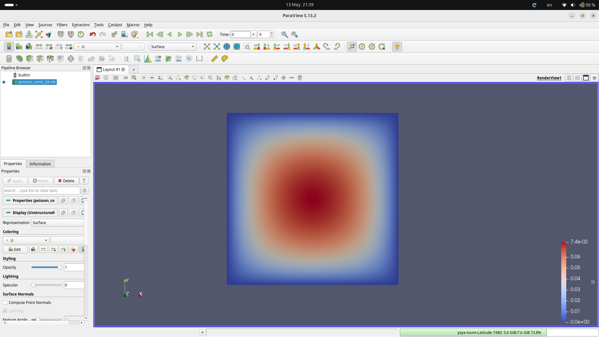
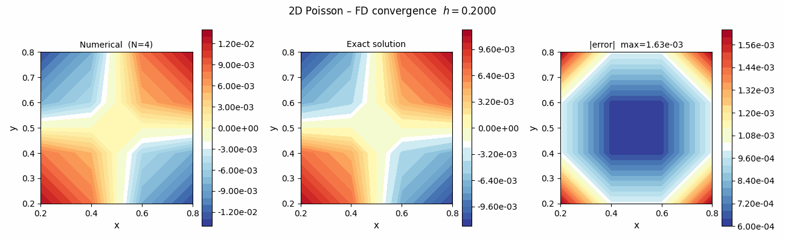
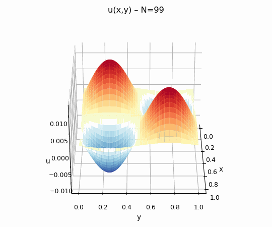
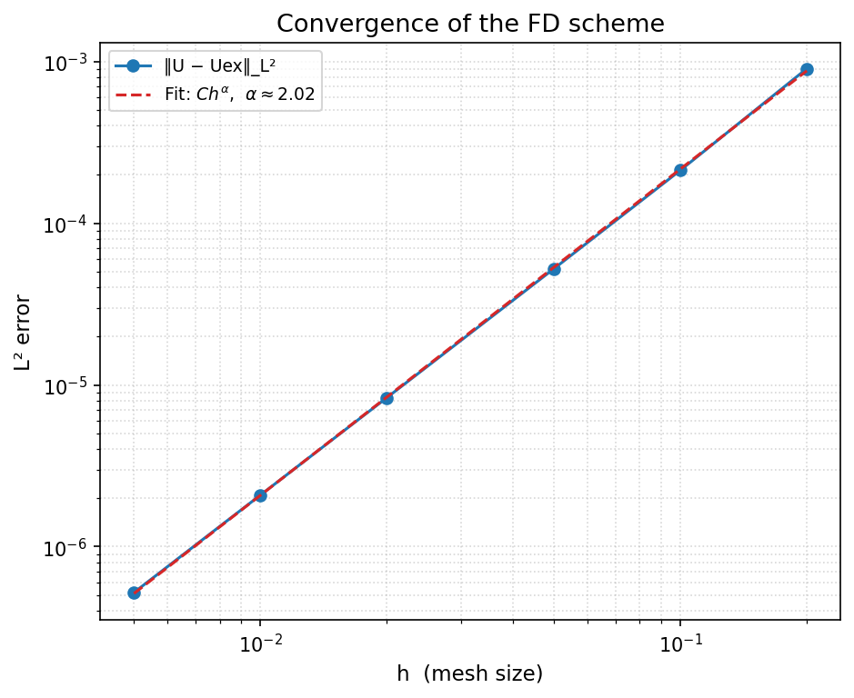
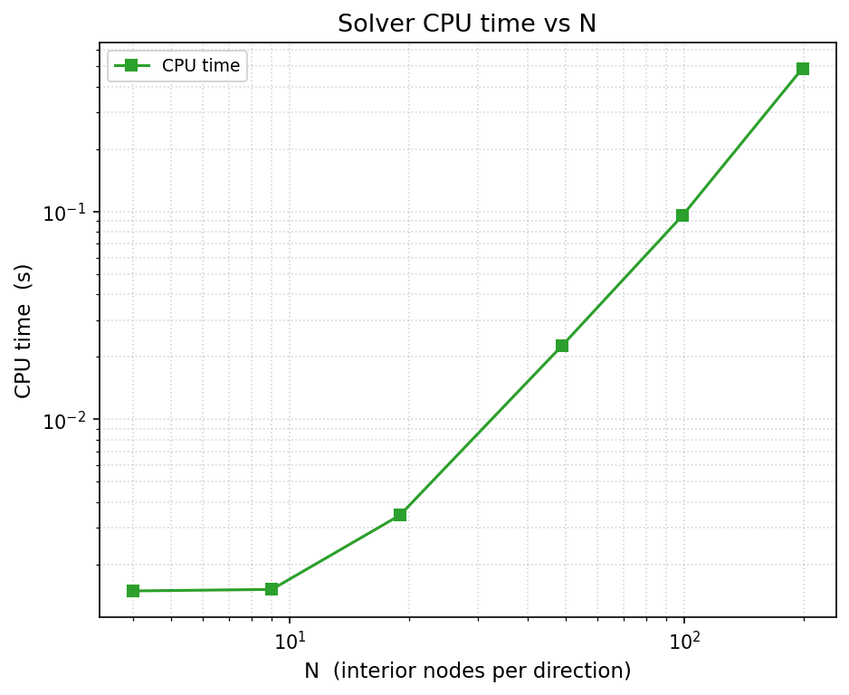
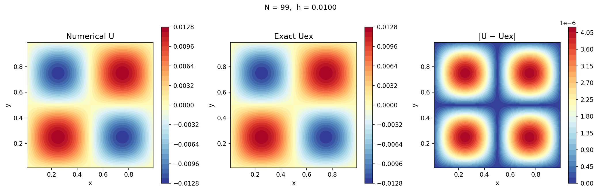

<div align="center">

#  Poisson2D — Finite Difference Solver

**2D Poisson equation solver on the unit square using the 5-point finite-difference scheme**

[](LICENSE)
[](https://www.python.org)
[](https://numpy.org)
[](https://www.paraview.org)
[](https://www.hdfgroup.org)
[](https://panel.holoviz.org)
[](https://www.univ-perp.fr)

---

*M1 CHPS · Université de Perpignan Via Domitia · 2025–2026*  
*Encadré par [**Serge Dumont**](https://perso.univ-perp.fr/sdumont/)*

</div>

---

## 📋 Table of contents

- [Problem statement](#-problem-statement)
- [Method](#️-method)
- [Project structure](#️-project-structure)
- [Installation](#-installation)
- [Usage](#️-usage)
- [Results](#-results)
  - [Paraview visualizations](#paraview-visualizations)
  - [Convergence animation](#convergence-animation)
  - [3D rotation](#3d-rotation)
  - [Convergence study](#convergence-study)
  - [CPU time](#cpu-time)
- [Interactive dashboard](#️-interactive-dashboard)
- [Output formats](#-output-formats)
- [License](#-license)

---

##  Problem statement

We solve the 2D Poisson problem with homogeneous Dirichlet boundary conditions on the unit square Ω = (0,1)²:

$$\begin{cases} -\Delta u = f & \text{in } \Omega \\ u = 0 & \text{on } \partial\Omega \end{cases}$$

| # | Source term `f(x,y)` | Exact solution |
|---|---|---|
| 1 | `sin(2πx) sin(2πy)` | `u = sin(2πx)sin(2πy) / (8π²)` |
| 2 | `1` (uniform) | — (no closed form) |

---

## ⚙️ Method

**5-point finite-difference stencil** on a uniform N×N interior grid with mesh size `h = 1/(N+1)`:

$$-\Delta_h U_{i,j} = \frac{-U_{i+1,j} - U_{i,j+1} + 4U_{i,j} - U_{i-1,j} - U_{i,j-1}}{h^2} = f(x_i, y_j)$$

This yields a sparse linear system **AU = B** of size N² × N², solved by **SuperLU** sparse direct solver.  
Matrix assembly uses **CSR format** via `scipy.sparse.diags` — no Python loop over N² entries.

| Property | Value |
|---|---|
| Consistency order | O(h²) |
| Convergence rate α | ≈ 2.02 (measured) |
| Matrix format | CSR sparse |
| Solver | SuperLU (`spsolve`) |
| Complexity | O(N² log N) |

---

## 🗂️ Project structure

```
poisson2d/
├── poisson2d/               ← installable Python package
│   ├── __init__.py          ← public API
│   ├── solver.py            ← grid, sparse matrix, solver, error analysis
│   ├── vtk_io.py            ← VTK Legacy ASCII export (2D scalar / 3D vector)
│   ├── hdf5_io.py           ← HDF5 read/write (ViTables-compatible)
│   ├── plotting.py          ← Matplotlib figures + animated GIFs
│   └── app.py               ← Panel interactive dashboard
├── scripts/
│   ├── paraview_render.py   ← headless pvpython batch render
│   └── info_hdf5.py         ← HDF5 tree inspector
├── docs/
│   └── assets/              ← figures and GIFs (used in this README)
├── outputs/                 ← generated at runtime (gitignored)
│   ├── vtk/                 ← .vtk files → Paraview
│   ├── hdf5/                ← .hdf5 files → ViTables
│   ├── figures/             ← static PNG plots
│   └── gif/                 ← animated GIFs
├── main.py                  ← full pipeline entry point
├── setup.py                 ← pip-installable package
├── requirements.txt
├── Makefile
└── LICENSE
```

---

##  Installation

```bash
# 1 — Clone
git clone https://github.com/<your-username>/poisson2d.git
cd poisson2d

# 2 — Virtual environment (recommended)
make venv
source .venv/bin/activate      # Linux / macOS
# .venv\Scripts\activate       # Windows

# 3 — Install dependencies
make install

# 4 — Install as editable package (enables `import poisson2d` anywhere)
make install-dev

# 5 — Verify everything works
make check
```

---

##  Usage

### Run the full pipeline

```bash
make run
```

Generates all VTK files, HDF5 files, figures, and GIFs under `outputs/`.

### Individual targets

```bash
make vtk           # VTK files only     → outputs/vtk/
make hdf5          # HDF5 file only     → outputs/hdf5/
make figures       # PNG figures only   → outputs/figures/
make gif           # Animated GIFs only → outputs/gif/
make solve         # Convergence study + rate estimation
```

### Paraview

```bash
make paraview            # open default VTK (sin/sin 2D) in Paraview GUI
make paraview-sin3d      # open 3D height-map
make paraview-const2d    # open f=1 solution
make paraview-render     # headless render via pvpython → PNG

# Override Paraview path
make paraview PARAVIEW=/opt/paraview/bin/paraview
```

### Inspection

```bash
make info-vtk      # print summary of all VTK files
make info-hdf5     # print HDF5 hierarchy with shapes and attributes
make tree          # show full project tree
```

### Cleanup

```bash
make clean         # remove outputs/
make clean-all     # remove outputs/ + cache + venv
```

### Use as a Python module

```python
from poisson2d import build_grid, build_laplacian, build_rhs, \
                      node_coords, solve_direct

import numpy as np

N        = 50
nodes, h = build_grid(N)
x, y     = node_coords(nodes, h)
A        = build_laplacian(N, h)
B        = build_rhs(lambda x,y: np.sin(2*np.pi*x)*np.sin(2*np.pi*y), nodes, h)
U        = solve_direct(A, B)
```

---

##  Results

### Paraview visualizations

> Files generated by `make vtk`, opened in **Paraview 5.13.2**.

<div align="center">

| `f = sin(2πx)sin(2πy)` — 2D scalar | `f = sin(2πx)sin(2πy)` — 3D Warp by Vector |
|:---:|:---:|
|  |  |

| `f = 1` (uniform source) — 2D scalar |
|:---:|
|  |

</div>

The 3D view uses the **Warp By Vector** filter in Paraview applied to the exported vector field `(0, 0, U)`.

---

### Convergence animation

> `outputs/gif/convergence.gif` — generated by `make gif`

The animation shows how the numerical solution improves as N increases from 4 to 99.  
Each frame: **numerical U** (left) · **exact ū** (center) · **pointwise error |U − ū|** (right).

<div align="center">



*As N increases, the error drops from ~10⁻³ (N=4) to ~2×10⁻⁶ (N=99)*

</div>

---

### 3D rotation

> `outputs/gif/rotation_3d.gif` — 360° rotation of the solution surface

<div align="center">



*Surface u(x,y) for f = sin(2πx)sin(2πy), N=99 — four symmetric lobes*

</div>

---

### Convergence study

<div align="center">



</div>

| N | h | ‖U − Uₑₓ‖_L² | Rate α | CPU (s) |
|--:|--:|--:|--:|--:|
| 4 | 2.00×10⁻¹ | 9.03×10⁻⁴ | — | 0.001 |
| 9 | 1.00×10⁻¹ | 2.13×10⁻⁴ | 2.09 | 0.004 |
| 19 | 5.00×10⁻² | 5.23×10⁻⁵ | 2.03 | 0.005 |
| 49 | 2.00×10⁻² | 8.34×10⁻⁶ | 2.01 | 0.026 |
| 99 | 1.00×10⁻² | 2.08×10⁻⁶ | 2.00 | 0.118 |
| 199 | 5.00×10⁻³ | 5.21×10⁻⁷ | 2.00 | 0.568 |

**Fitted convergence rate: α ≈ 2.0176** — confirms the expected O(h²) accuracy of the 5-point stencil.

---

### CPU time

<div align="center">



</div>

CPU time **grows with N** as expected (sparse LU solver complexity O(N² log N) to O(N³)).  
> ⚠️ A plot vs h would look decreasing since h = 1/(N+1) — always check the x-axis label.

---

### Numerical vs exact solution (N = 99)

<div align="center">



*Left: numerical U · Center: exact ū · Right: pointwise error |U − ū|  (max ≈ 10⁻⁵)*

</div>

---

##  Interactive dashboard

```bash
make dashboard
# → open http://localhost:5006
```

| Tab | Features |
|---|---|
|  **Solve** | Pick test case, set N with a slider, display U / ū / error side by side |
|  **Convergence** | Run a full convergence study over any N range with log-log plots |
|  **VTK viewer** | Upload any `.vtk` file and inspect its scalar fields interactively |

---

## 📁 Output formats

| File | Description | Open with |
|---|---|---|
| `outputs/vtk/poisson_sin_2d.vtk` | Scalar fields U and Uex (2D) | [Paraview](https://www.paraview.org) |
| `outputs/vtk/poisson_sin_3d.vtk` | Vector height-map (3D) | Paraview + Warp by Vector |
| `outputs/vtk/poisson_const_2d.vtk` | f=1 scalar field (2D) | Paraview |
| `outputs/vtk/poisson_const_3d.vtk` | f=1 height-map (3D) | Paraview |
| `outputs/hdf5/poisson_sin.hdf5` | Multi-resolution results N∈{4,9,19,49,99,199} | [ViTables](https://vitables.org) |
| `outputs/gif/convergence.gif` | Convergence animation N=4→99 | Browser / image viewer |
| `outputs/gif/rotation_3d.gif` | 360° rotation of the 3D surface | Browser / image viewer |

### HDF5 hierarchy

```
poisson_sin.hdf5
/                            ← root attrs: {alpha=2.0176, C=0.02253}
├── N=4/                     ← attrs: {N, h, error_l2, cpu_time}
│   ├── U      float64 (16,)       gzip compressed
│   └── Uex    float64 (16,)       gzip compressed
├── N=9/  ...
├── N=49/ ...
├── N=99/                    ← attrs: {h=0.01, error_l2=2.08e-6, cpu=0.118s}
│   ├── U      float64 (9801,)
│   └── Uex    float64 (9801,)
├── N=199/ ...
└── convergence/
    ├── N          int64   (6,)
    ├── h          float64 (6,)
    ├── error_l2   float64 (6,)
    └── cpu_time   float64 (6,)
```

---

## 📄 License

This project is licensed under the **MIT License** — see the [LICENSE](LICENSE) file for details.

---

<div align="center">

**M1 CHPS · Université de Perpignan Via Domitia · 2025–2026**  
Encadré par [Serge Dumont](https://perso.univ-perp.fr/sdumont/)

[](LICENSE)
[](https://www.python.org)
[](https://www.univ-perp.fr)

</div>
